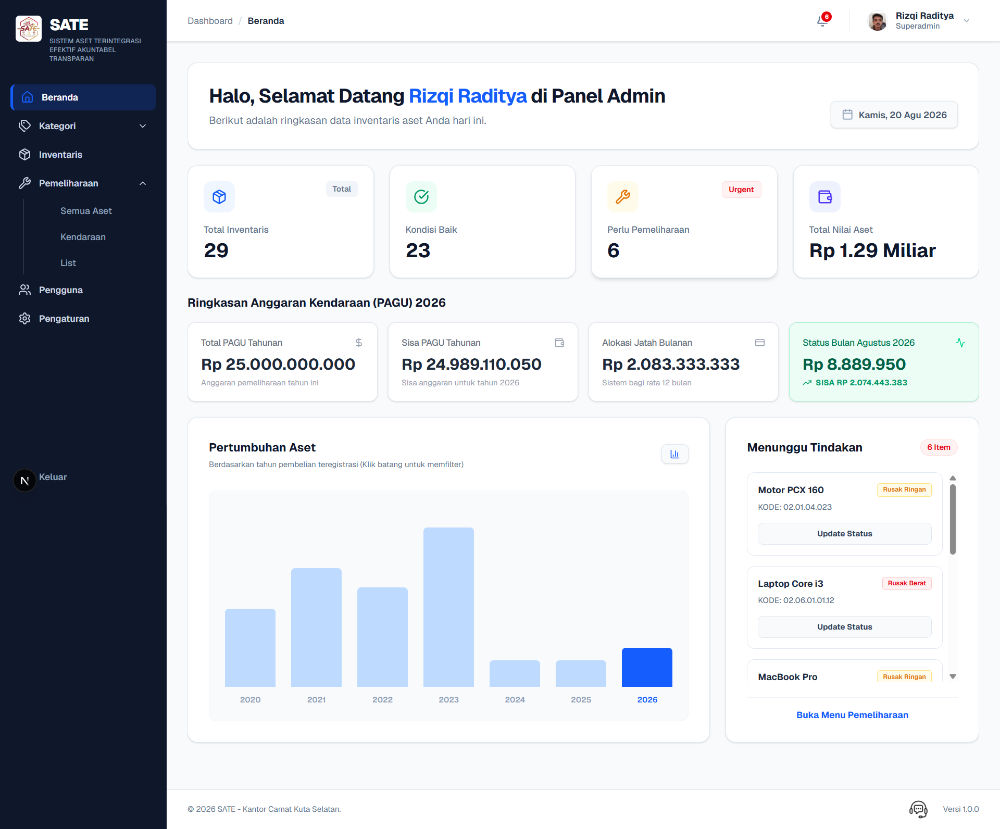
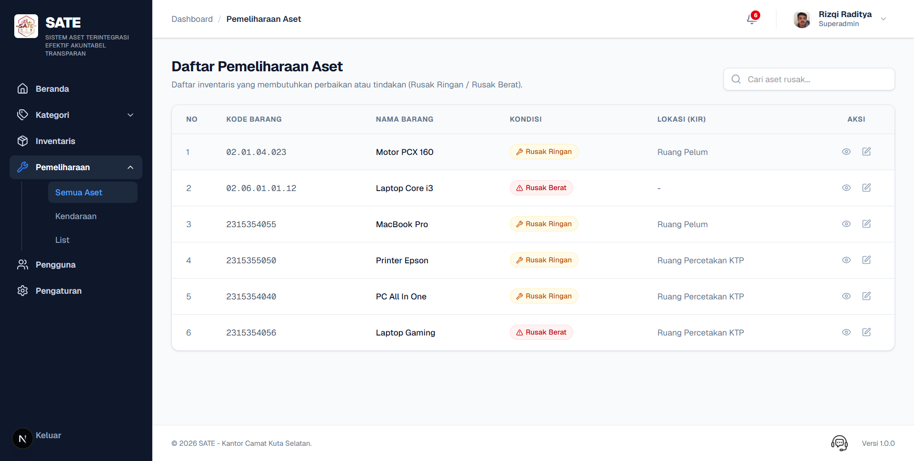
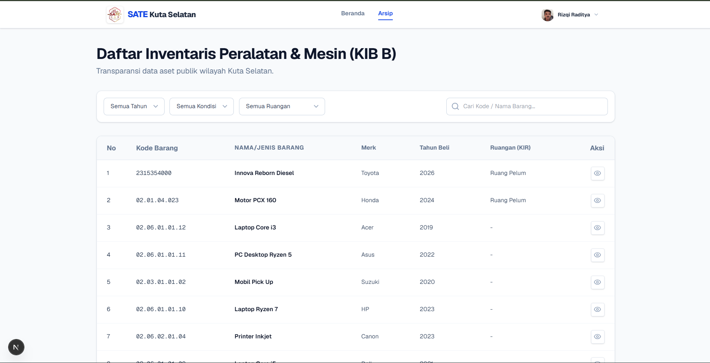
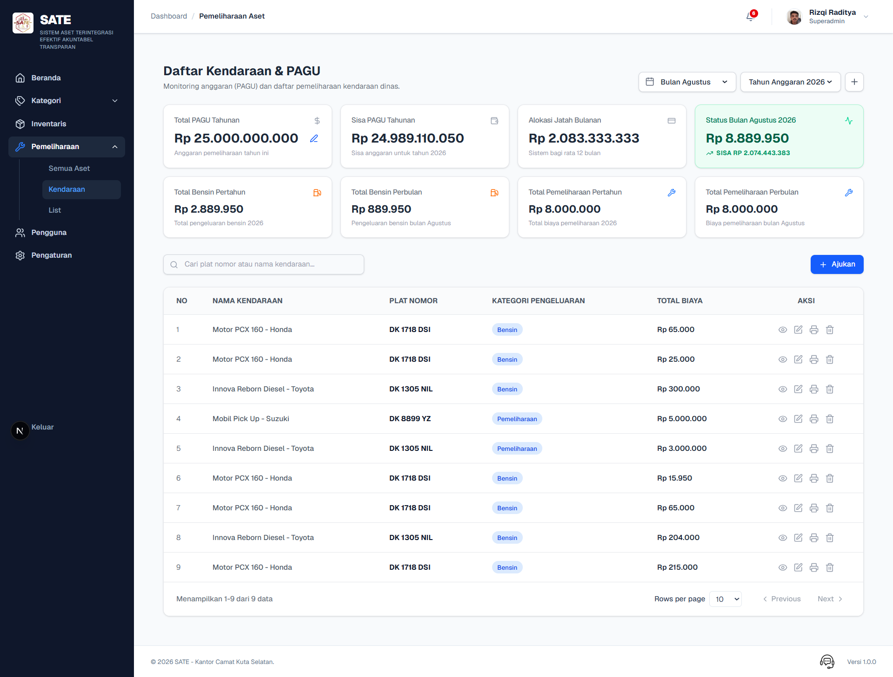
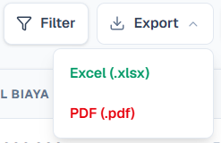

# 🗂️ SATE - Sistem Aset Terintegrasi Efektif Akuntabel Transparan

**SATE (Sistem Aset Terintegrasi Efektif Akuntabel Transparan)** adalah sebuah sistem informasi berbasis web yang dirancang untuk membantu proses pengelolaan aset dan arsip secara **terintegrasi, efektif, akuntabel, dan transparan**.

Sistem ini dikembangkan sebagai solusi digital untuk membantu proses pencatatan, pengelolaan, pemantauan, dan pelaporan aset secara lebih terstruktur. Dengan SATE, informasi aset dapat dikelola melalui sistem terpusat sehingga proses administrasi menjadi lebih efektif, data lebih mudah ditelusuri, serta informasi dapat digunakan untuk mendukung kebutuhan monitoring dan pelaporan.

🌐 **Live Website:** https://sate.gdpartstudio.my.id/

📦 **Repository:** https://github.com/DanielWidhi/e-arsip

---

## ✨ Fitur Utama

SATE menyediakan berbagai fitur yang mendukung proses pengelolaan aset dan arsip, antara lain:

### 📦 Manajemen Aset

* 🏷️ **Pencatatan Data Aset**
  Mengelola informasi aset secara terstruktur dan terpusat.

* 📋 **Data Aset Terintegrasi**
  Menyimpan dan mengelola data aset dalam satu sistem.

* 🔎 **Pencarian & Penyaringan Data**
  Memudahkan pengguna dalam menemukan data aset berdasarkan informasi tertentu.

* 📊 **Monitoring Aset**
  Membantu pengguna memantau informasi dan kondisi aset yang tersedia.

### 📁 Manajemen Arsip

* 🗃️ **Pengelolaan Arsip Digital**
  Membantu menyimpan dan mengelola arsip secara digital.

* 🔍 **Pencarian Arsip**
  Memudahkan pengguna dalam menemukan arsip yang dibutuhkan.

* 📄 **Dokumentasi Arsip**
  Mendukung pengelolaan dokumen agar lebih terstruktur dan mudah diakses.

### 📊 Dashboard & Pelaporan

* 📈 **Dashboard Informasi**
  Menampilkan ringkasan informasi aset dan arsip dalam satu halaman.

* 📑 **Rekapitulasi Data**
  Menyediakan informasi yang dapat digunakan untuk kebutuhan monitoring dan administrasi.

* 📊 **Pengolahan Data**
  Mendukung pengelolaan data untuk kebutuhan pelaporan.

### 📤 Export Data

* 📄 **Export PDF**
  Menghasilkan dokumen atau laporan dalam format PDF.

* 📊 **Export Excel**
  Mengekspor data untuk kebutuhan pengolahan dan administrasi lebih lanjut.

---

## 🛠️ Tech Stack

Teknologi yang digunakan dalam pengembangan SATE:

* **Framework:** Next.js
* **Programming Language:** TypeScript
* **Frontend:** React
* **UI Components:** shadcn/ui
* **Styling:** Tailwind CSS
* **Database:** Supabase / PostgreSQL
* **Backend Services:** Supabase
* **PDF:** jsPDF + jsPDF AutoTable
* **Spreadsheet:** XLSX
* **CSV Processing:** PapaParse
* **Deployment:** Vercel
* **Version Control:** Git & GitHub

---

# 📸 Cuplikan Layar (Screenshots)

Berikut adalah beberapa tampilan antarmuka dari aplikasi **SATE**.

### 1. 🏠 Dashboard

Halaman dashboard yang menampilkan ringkasan informasi sistem dan data aset secara terpusat.

<p align="center">
  
</p>

---

### 2. 📦 Manajemen Aset

Halaman yang digunakan untuk melihat dan mengelola data aset yang tersimpan dalam sistem.

<p align="center">
  
</p>

---

### 3. 📁 Manajemen Arsip

Halaman untuk mengelola dan melihat data arsip secara digital.

<p align="center">
  
</p>

---

### 4. 📊 Rekapitulasi & Pelaporan

Halaman yang membantu pengguna melihat rekapitulasi data untuk kebutuhan monitoring dan pelaporan.

<p align="center">
  
</p>

---

### 5. 📄 Export Data

Fitur untuk mengekspor data sistem ke dalam format PDF maupun spreadsheet.

<p align="center">
  
</p>

---

# 🚀 Persiapan & Instalasi Proyek

Ikuti langkah-langkah berikut untuk menginstal dan menjalankan proyek SATE secara lokal.

## 1. Clone Repository

Buka terminal dan jalankan perintah berikut:

```bash
git clone https://github.com/DanielWidhi/e-arsip.git
```

Kemudian masuk ke folder project:

```bash
cd e-arsip
```

---

## 2. Install Dependency

Install seluruh dependency yang dibutuhkan:

```bash
npm install
```

---

## 3. Install jsPDF

SATE menggunakan **jsPDF** dan **jsPDF AutoTable** untuk kebutuhan pembuatan dokumen PDF:

```bash
npm install jspdf jspdf-autotable
```

---

## 4. Install XLSX & PapaParse

Untuk kebutuhan pengolahan data spreadsheet dan CSV:

```bash
npm install xlsx papaparse
```

Kemudian install TypeScript definitions untuk PapaParse:

```bash
npm install -D @types/papaparse
```

---

## 5. Install shadcn/ui

SATE menggunakan **shadcn/ui** untuk membantu membangun komponen antarmuka pengguna.

Jalankan:

```bash
npx shadcn-ui@latest init
```

Kemudian ikuti konfigurasi yang diberikan oleh CLI.

---

## 6. Install Supabase

SATE menggunakan **Supabase** untuk kebutuhan database dan layanan backend.

Install package Supabase:

```bash
npm install @supabase/supabase-js @supabase/ssr
```

---

## 7. Konfigurasi Supabase

Buat file:

```text
.env.local
```

Kemudian masukkan konfigurasi Supabase:

```env
NEXT_PUBLIC_SUPABASE_URL=your_supabase_url
NEXT_PUBLIC_SUPABASE_ANON_KEY=your_supabase_anon_key
```

Sesuaikan nilai tersebut dengan konfigurasi project Supabase yang digunakan.

> ⚠️ Jangan commit file `.env.local` ke repository apabila berisi credential atau secret.

---

## 8. Install Vercel CLI

Jika ingin melakukan deployment menggunakan Vercel, install Vercel CLI secara global:

```bash
npm i -g vercel
```

---

# ▶️ Menjalankan Aplikasi

Setelah seluruh dependency selesai di-install, jalankan development server:

```bash
npm run dev
```

Kemudian buka browser dan akses:

```text
http://localhost:3000
```

Aplikasi akan berjalan dalam mode development dan perubahan pada source code akan otomatis diperbarui.

---

# 📦 Instalasi Lengkap

Seluruh instalasi tambahan yang digunakan dalam project:

```bash
npm install

npm install jspdf jspdf-autotable

npm install xlsx papaparse

npm install -D @types/papaparse

npx shadcn-ui@latest init

npm install @supabase/supabase-js @supabase/ssr

npm i -g vercel
```

---

# 🌐 Deployment

Project dapat di-deploy menggunakan **Vercel**.

Setelah Vercel CLI terinstall:

```bash
npm i -g vercel
```

Login ke akun Vercel:

```bash
vercel login
```

Kemudian lakukan deployment:

```bash
vercel
```

Untuk deployment production:

```bash
vercel --prod
```

Pastikan environment variable Supabase telah dikonfigurasi pada project Vercel.

---

# 📚 Learn More

Untuk mempelajari teknologi yang digunakan dalam project ini:

* **Next.js:** https://nextjs.org/docs
* **React:** https://react.dev/
* **shadcn/ui:** https://ui.shadcn.com/
* **Supabase:** https://supabase.com/docs
* **Vercel:** https://vercel.com/docs
* **jsPDF:** https://github.com/parallax/jsPDF
* **PapaParse:** https://www.papaparse.com/
* **SheetJS:** https://docs.sheetjs.com/

---

# 🎯 Tujuan Pengembangan

SATE dikembangkan dengan tujuan untuk:

* Meningkatkan efektivitas pengelolaan aset.
* Membantu proses pencatatan aset secara terstruktur.
* Mengintegrasikan informasi aset dalam satu sistem.
* Mempermudah monitoring dan pencarian data.
* Mendukung digitalisasi pengelolaan arsip.
* Mempermudah proses dokumentasi dan pelaporan.
* Meningkatkan transparansi dalam pengelolaan aset.
* Mengurangi ketergantungan terhadap proses administrasi manual.

---

# 💻 Getting Started

This is a [Next.js](https://nextjs.org) project bootstrapped with [`create-next-app`](https://github.com/vercel/next.js/tree/canary/packages/create-next-app).

First, run the development server:

```bash
npm run dev
# or
yarn dev
# or
pnpm dev
# or
bun dev
```

Open http://localhost:3000 with your browser to see the result.

You can start editing the page by modifying `app/page.tsx`. The page auto-updates as you edit the file.

This project uses `next/font` to automatically optimize and load Geist, a new font family for Vercel.

---

# 🚀 Deploy on Vercel

The easiest way to deploy this project is to use the Vercel Platform from the creators of Next.js.

The project can be deployed using:

```bash
vercel
```

For production deployment:

```bash
vercel --prod
```

---

# 📌 Project Information

**SATE — Sistem Aset Terintegrasi Efektif Akuntabel Transparan**

🌐 **Live Website:**
https://sate.gdpartstudio.my.id/

💻 **GitHub Repository:**
https://github.com/DanielWidhi/e-arsip

👨‍💻 **Repository Owner:** DanielWidhi

---

## 📄 Original Installation

The following packages are also part of the original project setup:

```bash
npm install jspdf jspdf-autotable
npm install xlsx papaparse
npm install -D @types/papaparse
npm i -g vercel
```

Additional packages:

```bash
npx shadcn-ui@latest init

npm install @supabase/supabase-js @supabase/ssr
```
